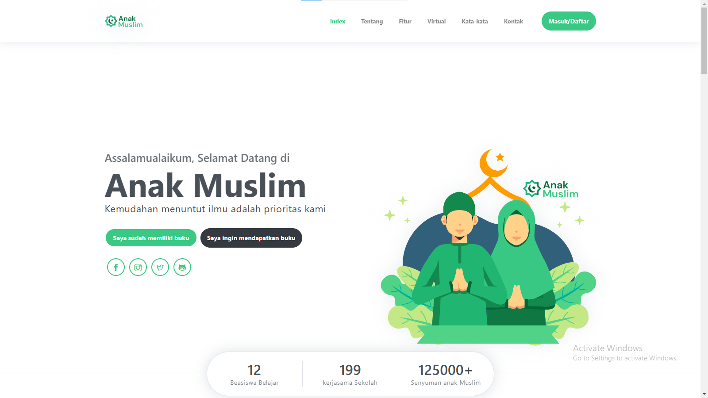
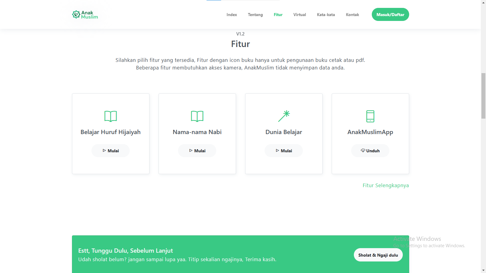
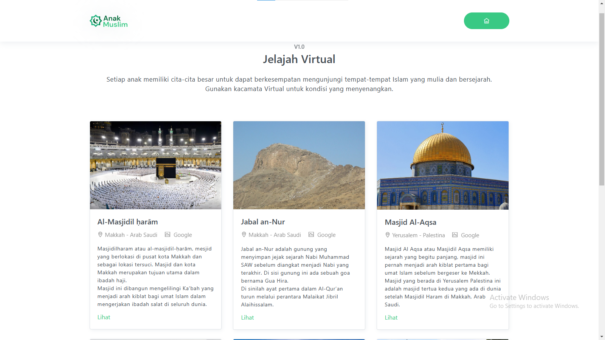
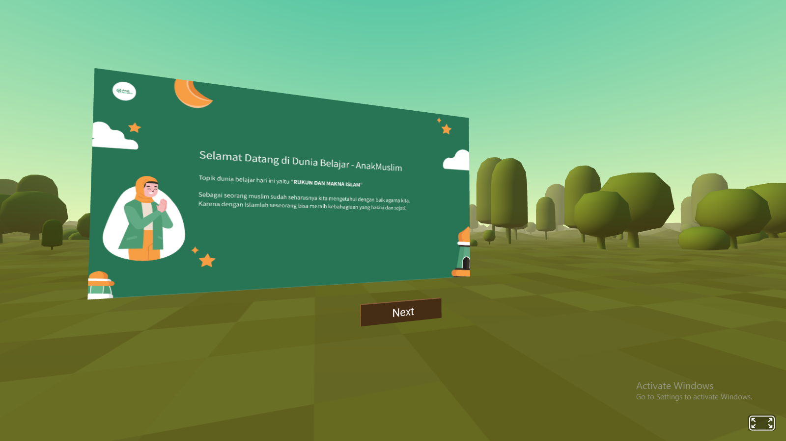

# AnakMuslim

------

# Bimamaarschal

<p align="center">
  
  <p align="center">
    <strong>Semua Kode terdokumentasi di <a href="https://github.com/Bimamaarschal/AnakMuslim">Github</a></strong>.
  </p>
  <br>
  <p align="center">
    <strong>Semua Kode tersimpan di <a href="https://drive.google.com/drive/folders/1yrW4XDKotKfDJ1tseRNVDeH4VhmCpE8q?usp=sharing">Google Drive</a></strong>.
  </p>
  <br>
  <br>
  <p align="center">
    <strong>Tampilkan Aplikasi <a href="https://bimamaarschal.github.io/AnakMuslim/">Web</a></strong>.
  </p>
  <br>
</p>

**✍ Kata Pengantar** 
<br>
Saya BimaMaarschal, Saya memahami bahwa tidak ada aplikasi yang sempurna, termasuk aplikasi AnakMuslim Web ini, aplikasi AnakMuslim Web Ini mengabungkan dunia virtual dengan dunia nyata, saya melihat pentingnya pembelajaran Agama Islam yang tidak hanya tepaku pada konteks membaca dan statis tetapi perlu di dampingi dengan kemajuan teknologi yang dinamis dan penuh dengan hiburan yang menyenangkan untuk anak-anak.
<br>
<br>
Aplikasi Anak Muslim di harapkan dapat memberikan kesan baru dan menyenangkan dalam belajar agama Islam.
<br>
<br>
Insyaallah saya akan terus berusaha memperbaiki, mengembangkan dan meUpdate, aplikasi #AnakMuslim ini. Mohon doanya Terima kasih.


## 🚀 Tentang Aplikasi

```
AnakMuslim adalah perangkat lunak berbasis web yang digunakan sebagai media belajar 
Islam yang menyediakan ruang belajar berbasis Virtual Reality, Audio Simulasi, dan 
Augmented Reality. AnakMuslim memiliki satu tujuan yaitu untuk membantu setiap 
anak-anak Muslim agar dapat memahami lebih dalam, tentang Islam dan indahnya berbagi 
dengan sesama manusia.


```

## ⌨ Memulai

```
run & clone

https://github.com/Bimamaarschal/AnakMuslim.git

```

## ⛏ Berjalan
-- **Web** Android, Iphone, Linux <br>
-- **Server** github.io <br>
-- **Server Support** github.io<br>
-- **AFrame**<br>
-- **AR.Js**

## ✨ Fitur



- **Index** Tampilan awal selamat datang, di tampilan ini pengguna memulai perjalan pembelajaran.



- **Fitur** Kumpulan Fitur, kumpulan fitur merupakan awal pengguna memilih fitur yang ingin digunakan. Terdapat beberapa fitur utama yang dapat digunakan.



- **Virtual** Salah satu fitur yang dapat digunakan pengguna, di dalam fitur virtual semua akan terlihat secara nyata.



- **Dunia Belajar** Salah satu fitur yang dapat digunakan pengguna, masuk dunia baru yang lebih  menyenangkan dan produktif.


## ✒ Spesifikasi Desain Perangkat Lunak (SDS)
**Semua kode pada aplikasi dan perancangan aplikasi AnakMuslim di buat oleh Bima Maarschal dan di dokumentasikan secara terstruktur di SDS Dokumen pada link <a href="https://bimamaarschal.github.io/AnakMuslim/sds.html">https://bimamaarschal.github.io/AnakMuslim/sds.html</a>**

## 💖 Pembuat
**Semua kode pada aplikasi AnakMuslim di buat oleh Bima Maarschal**

**Klik bintang untuk support**

Hubungi bimamaarschal@gmail.com untuk informasi yang dibutuhkan.
Terima kasih.
